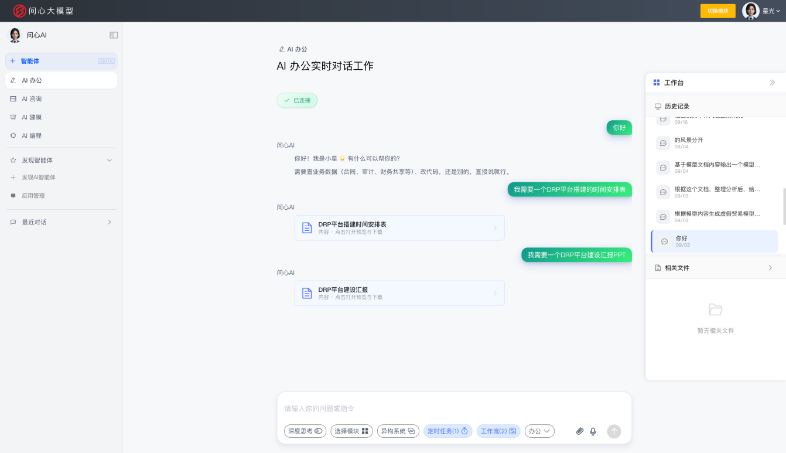
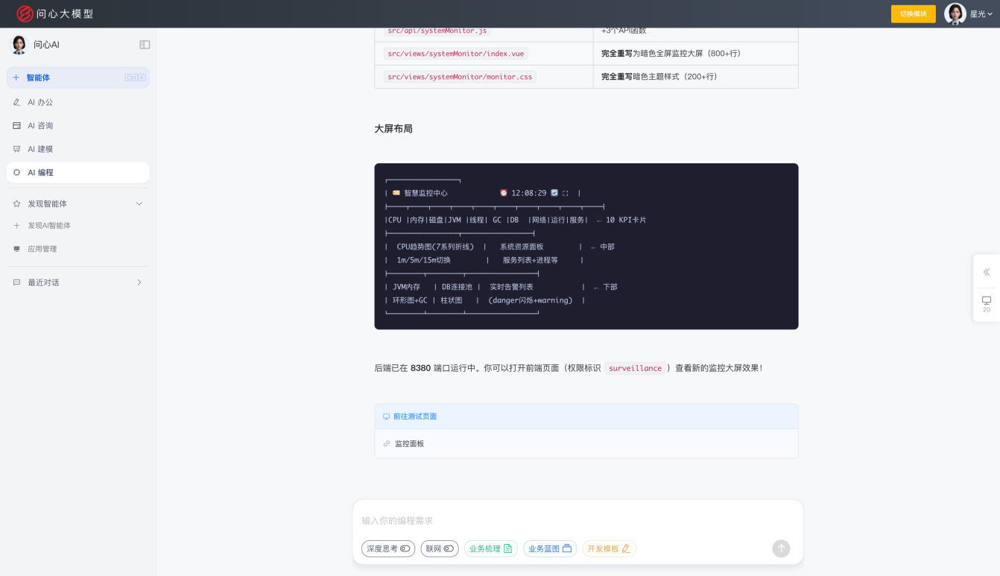
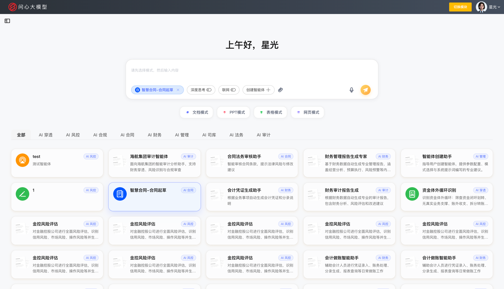
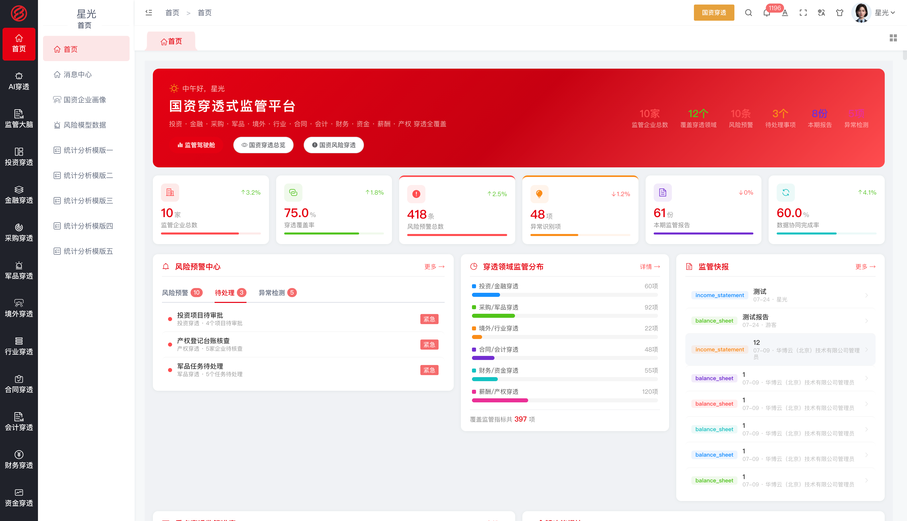
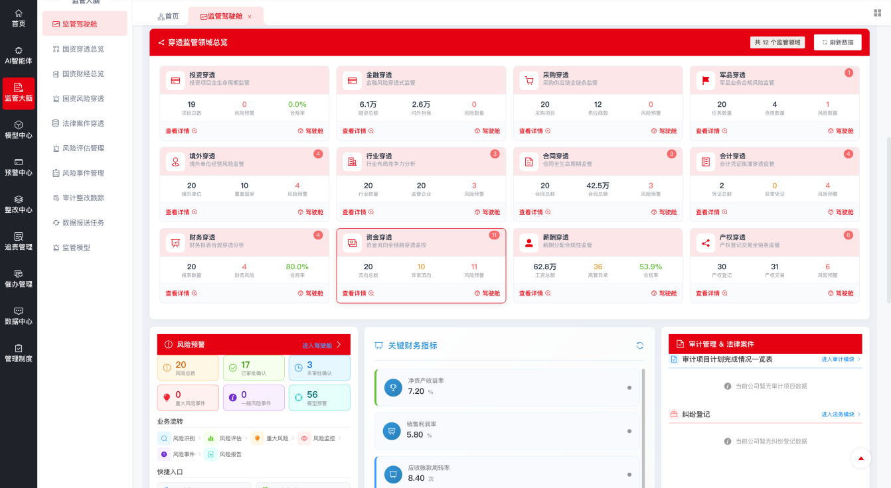
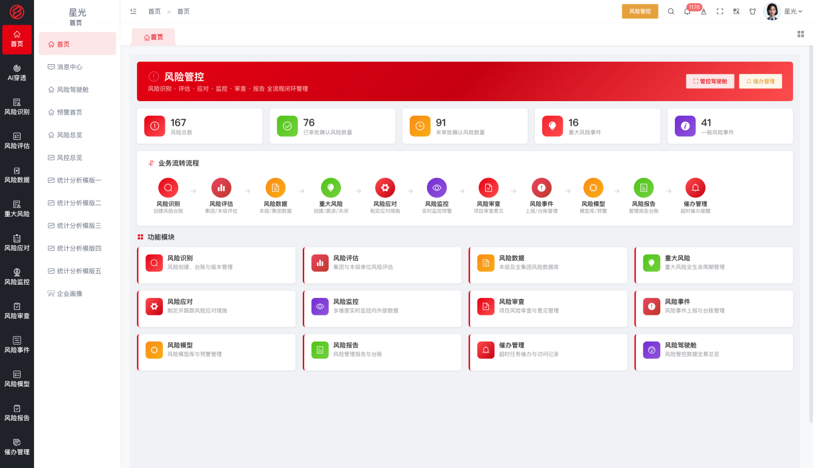
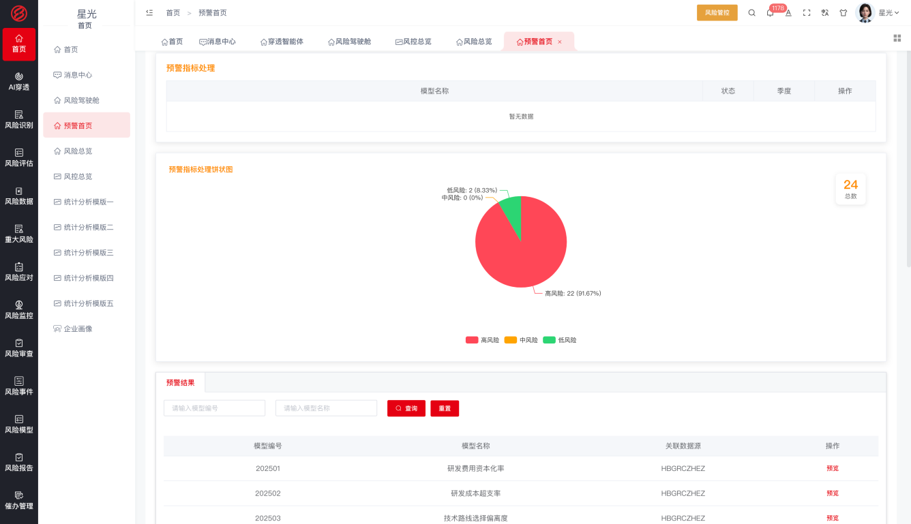
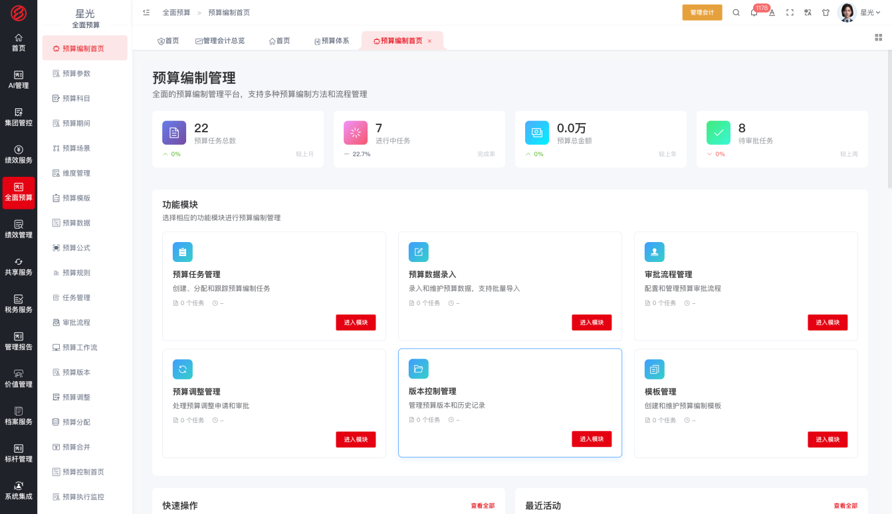
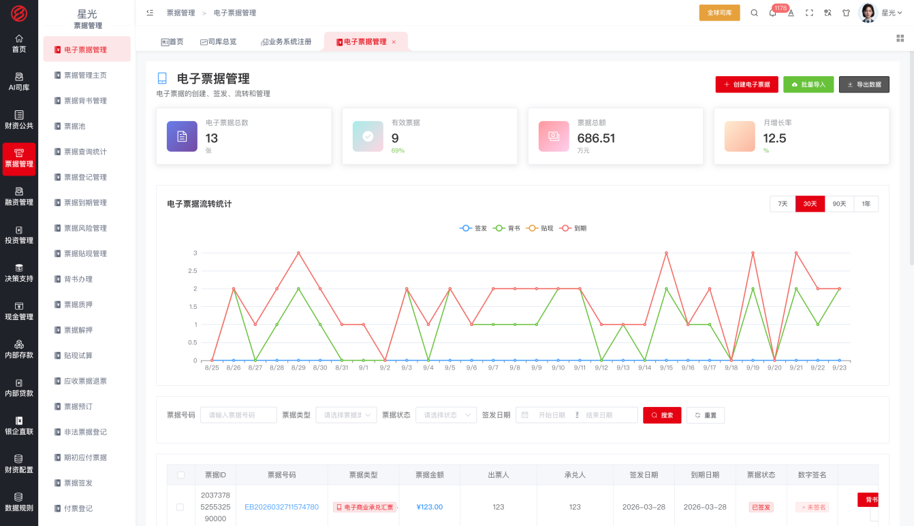
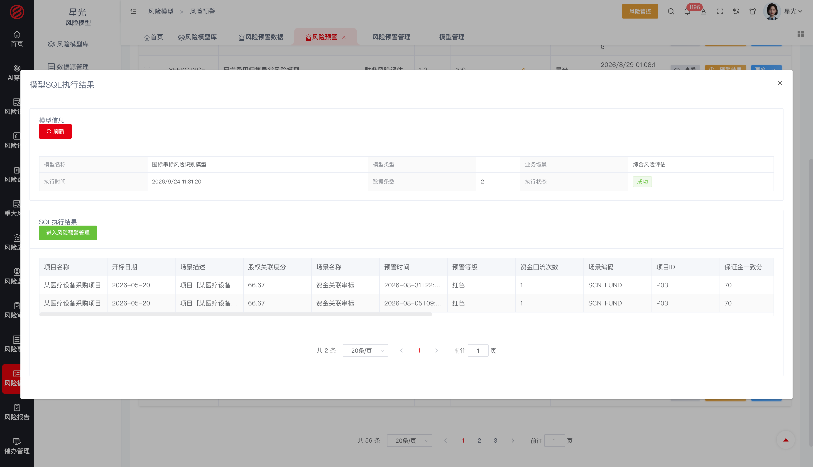

# 问心大模型 · 财经垂直领域大模型

> 让 AI 有能力，直接解决企业问题 ｜ 软件层全部开源，永久免费

   

## 平台简介

问心大模型是由华博云（北京）技术有限公司联合哈尔滨工业大学技术团队研发的财经垂直领域大模型，聚焦财经大脑，深度融合财经领域知识与推理决策能力，让 AI 有能力直接解决企业问题。

平台提供三种工作方式与五大引擎；问心大模型的财经能力形成四大智能。模型与五大引擎共同构成企业 AI 本体，进而生长出覆盖财经全链条的十项应用。应用基于 AI 能力构建，可随业务快速迭代和调整。

**三种工作方式**

- **菜单式** —— 通过功能菜单使用应用，开箱即用
- **技能式** —— 将大模型能力封装为可组合的技能，按场景编排调用
- **对话式** —— 与大模型对话直达业务操作，AI 直接解决问题

**四大智能**

- **AI 办公** —— 大模型的对话工作能力，让日常办公事务自然语言化
- **AI 咨询** —— 大模型的管理咨询能力，财经专家知识沉淀为智能问答
- **AI 建模** —— 大模型的动态建模能力，指标、规则、风险模型随业务动态构建
- **AI 编程** —— 大模型的应用生成能力，动态建模、实时编程、随时交付

四大智能运行于企业 AI 本体之上，作用于企业的业务对象与规则，形成从模型能力到业务执行的价值闭环。

| **AI 办公** | **AI 咨询** | **AI 建模** | **AI 编程** |
|---|---|---|---|
|   |   |    |   |

**问心智能体**

问心智能体是承载四大智能、执行业务的运行单元：在智能体平台上把模型能力、知识库、工具与业务流程编排在一起，作用于企业 AI 本体，下发到业务模块中使用，覆盖从搭建到使用的全流程。

- **搭建** —— 在智能体平台创建应用（对话型或工作流型），可视化编排工作流节点（大模型调用、知识检索、条件分支、模板转换、代码执行、工具调用等），编写提示词、配置模型参数；挂载知识库（上传企业制度与业务文档构建检索增强）与工具插件，让智能体具备企业知识与业务能力
- **调试与发布** —— 通过会话调试验证效果，确认后发布应用并自动获得 API 密钥；支持草稿调试与发布版运行双轨
- **授权下发** —— 在系统设置的智能体管理中，将智能体下发授权到业务模块与成员，控制谁在哪里可以使用
- **使用** —— 业务人员在业务模块内通过 AI 助手调用智能体，以对话交互提出业务诉求，智能体理解后执行相应的业务操作；同时支持以对话方式直达业务
- **运行留痕** —— 对话历史与运行记录留存可查，支撑智能体持续优化

|  |  |

**五大引擎**

组织引擎 · 角色引擎 · 流程引擎 · 表单引擎 · 规则引擎 —— 大模型融入企业运行的运行底座。

**企业 AI 本体**

企业 AI 本体是企业的数字孪生与运营层：将企业的组织架构、业务对象、关联关系与管控规则建模为标准化的知识体系。其根基由三部分构成——企业专属的开发模板约束 AI 的行为规范，MCP 工具接入企业知识与规范，技能授权划定能力边界与执行审批。问心大模型运行于本体之上，成为懂本企业架构、规范与业务的 AI，在企业内持续运行、学习与执行业务。

**平台架构**

问心大模型自上而下分为四层：大模型底座、五大引擎、企业 AI 本体、四大智能的应用。大模型底座提供财经领域的理解、推理与决策能力；组织、角色、流程、表单、规则五大引擎将企业运行要素建模为标准化的知识体系；二者共同构成企业 AI 本体——企业的数字孪生与运营层，沉淀业务对象、关联关系与管控规则。四大智能运行于本体之上，生长出覆盖企业监管与经营全业务链条的应用。

## 十项财经应用

以下应用均基于问心大模型平台搭建，是四大智能在财经业务场景中的落地形态，覆盖企业监管与经营全业务链条；各应用可单独使用，也可一体化运行。

| # | 应用 | 一句话简介 |
|---|---|---|
| 1 | 国资穿透 | 十三大穿透式监管维度，从集团总部到末端企业的全层级穿透，掌握真实经营状况 |
| 2 | 风险管控 | 风险识别、评估、监控、预警、处置全生命周期管理，智能风控驾驶舱实时掌握风险态势 |
| 3 | 内控合规 | 内控矩阵管理、合规规则库、合规性检查与流程执行监控，确保经营符合法规要求 |
| 4 | 智慧合同 | 合同全生命周期管理，AI 智能审查与法律风险识别，降低合同履约风险 |
| 5 | 财务共享 | 总账、应收、应付、固定资产、费用报销集中处理，提升财务运营效率 |
| 6 | 管理会计 | 成本中心、产品成本、内部结算、多维成本分析与控制，支撑管理决策 |
| 7 | 全球司库 | 现金管理、账户管理、资金规划、投融资管理、票据管理、衍生品管理 |
| 8 | 智慧法务 | AI 智能处理法律文件审核、合规检查、案例检索及法律分析建议 |
| 9 | 敏捷审计 | 审计计划、疑点发现、问题整改的全流程管理与 AI 辅助工具提升效率 |
| 10 | 整改追责 | 问题发现后的整改跟踪、责任追溯、闭环管理与成效评估 |

### 应用界面预览

| 应用 | 界面 |
|---|---|
| **1. 国资穿透** |   |
| **2. 风险管控** |   |
| **3. 内控合规** |   |
| **4. 智慧合同** |   |
| **5. 财务共享** |   |
| **6. 管理会计** |   |
| **7. 全球司库** |   |
| **8. 智慧法务** |   |
| **9. 敏捷审计** |   |
| **10. 整改追责** |   |

## 开源声明

本项目软件层（全部业务模块）开源且永久免费：个人和企业均可免费使用、允许修改，禁止商用——任何企业、机构和个人不得将本软件售卖或包装为收费产品/服务对外提供。

- **版本体系**：政府监管版 / 中央企业版 / 国有企业版 / 上市公司版 / 国际企业版 / 高校实训版 / 行业定制版 / 开源免费版
- **数据库适配**：全面适配信创环境（达梦 DM / Oracle / MySQL），满足央国企国产化要求
- **开源许可协议**：免费使用 · 禁止商用

| 权利义务 | 说明 |
|---|---|
| ✓ 个人使用 | 允许——个人学习、研究、使用，完全免费 |
| ✓ 企业使用 | 允许——企业内部安装、部署，应用于自身经营管理，永久免费 |
| ✓ 修改 | 允许——可按自身业务需要修改、二次开发（修改版同样禁止商用） |
| × 商用（禁止） | 不得将本软件（含修改版及衍生版）直接或间接售卖、转售、收费分发 |
| × 商用（禁止） | 不得将本软件包装为收费产品或收费服务（含 SaaS 模式）对外提供 |
| ！商业授权 | 如需转售、集成到收费产品、对外提供收费服务，须另行签订书面商业授权协议 |
| ！版权声明 | 使用及传播须保留原始版权声明 |
| × 责任担保 | 不提供——软件按"现状"提供，不承担任何明示或暗示的担保责任 |

适用场景：个人学习研究、企业内部免费使用；商业合作（转售、集成、收费服务）须获得商业授权。

## 联系我们

- 官网：https://huabocn.com
- 邮箱：18600042653@163.com

问心大模型 · 驾驭 AI，问内心

---
# 问心大模型构建风险管控

风险管控覆盖风险识别、评估、监控、预警、处置全生命周期，把风险管理从事后统计变成实时动态监控。

## 功能组成

### 首页与消息中心

首页汇聚风险数量、等级分布、处置进度等统计，消息中心按催办、任务、审批分类推送提醒，风险工作统一入口。

### 风险识别

风险创建按风险类型建立风险清单，风险台账按类型、等级筛选呈现（未评估、很低、低、中、高分色显示），版本管理保留风险调整的历史轨迹，风险底账动态更新、全程可追溯。

### 风险评估

集团评估计划统一下达，评估计划分解到企业，评估任务落实到人；评估按统一标准执行，结果确定风险等级；评估跟踪记录推进过程，集团跟进结果逐级汇总，评估结论沉淀为企业风险画像。评估标准统一配置，不同企业、不同期间口径可比。

### 重大风险管理

重大风险创建、填报、汇总、台账逐级管理，月度评估与月度评估汇总按月跟踪，重大风险跟踪盯住处置进展，风险监督改进对改进措施逐项验证销号——重大风险逐月跟踪、逐项改进，汇总按周期上报，改进不落空。

### 风险监测指标

监测指标创建、填报、汇总，按企业与集团两级汇总；指标持续量化监测风险状态，指标异常即触发预警，为风险驾驶舱与风险报告提供数据。

### 风险事件

风险从可能性变成现实后，通过风险事件填报进入事件管理，事件经过、处置过程与结果全程留痕，事件案例反哺风险识别。

### 风险审查

项目风险审查对重大业务事项在决策前把关，风险审查意见随项目留档，审查结论可追溯。

### 风险数据

风险数据库汇聚本企业风险记录，集团风险数据库跨企业汇聚，按年度、类型、等级检索对比，风险积累趋势可查可比。

### 风险模型

数据源管理维护取数来源，风险模型库统一管理风险模型，支持 Excel 批量导入；模型执行结果自动生成风险预警，预警列表支持逐条处理与批量处理，处理时可穿透查看预警源数据，定位问题数据。

### 风险报告与催办管理

风险管理报告按周期编制，风险报告汇总逐级上报；催办信息对未按期完成的风险任务自动催办，访问记录留痕，保障风险管理节奏。

### 管理制度

汇集集团制度、公司制度、法律章程与知识平台，风险判定与处置有制度依据可查可引用。

## 业务流程

风险创建进入台账、版本管理——集团评估计划下达、任务到人、评估定级——重大风险进入专项管理逐月评估跟踪——监测指标持续监测、异常触发预警——风险发生即事件填报处置——重大项目决策前风险审查把关——报告按周期汇总上报，催办保障全程节奏。

## 业务价值

风险管控让风险管理从人工经验升级为系统化、模型化运作：风险有底账、评估有计划、重大风险有月度跟踪、监测有指标、处置有催办、报告有汇总，配合风险模型库自动生成预警并支持源数据穿透，实现风险的实时动态监控。

## 本仓库内容

| 服务 | 端口 | 说明 |
|---|---|---|
| hbyunRiskControl | 8082 | 风险管控服务 |
| doc/ | — | [后端服务启动说明](doc/后端服务启动说明.md)：构建配置、数据库准备、脱敏配置对照、启动步骤与常见问题排查 |

依赖基础模块仓库（问心大模型基础模块）提供的注册中心、网关、系统模块与 AI 大模型服务支撑。

## 技术栈与启动

- 技术栈：Spring Boot / Spring Cloud（Eureka + Gateway）、JDK 1.8、Maven 3.6+、达梦/MySQL 数据库、Redis。
- 启动顺序：先启动基础模块仓库中的注册中心与网关，再启动本模块：`mvn spring-boot:run`。
- 首次构建前需安装离线 jar（达梦驱动等，见基础模块仓库 repository 目录），详见[后端服务启动说明](doc/后端服务启动说明.md)。
- 代码已脱敏：数据库密码、密钥、IP 均为占位值，启动前需替换为真实环境配置（application-dev.yml）。

## 问心大模型开源仓库导航

| 仓库 | 说明 |
|---|---|
| [问心大模型初始化数据](https://gitee.com/huabo-cloud-beijing-technology/wenxindamoxingchushihuashuju) | 全部业务模块与流程引擎的表结构、模拟数据 |
| [问心大模型智能体平台](https://gitee.com/huabo-cloud-beijing-technology/wenxindamoxingzhinengtipingtai) | 智能体平台，需要配套基于星光问心AI大模型平台使用 |
| [问心大模型流程引擎Docker镜像](https://gitee.com/huabo-cloud-beijing-technology/wenxinLLMProcessEngine) | 流程引擎管理端前端产物与部署说明，自由配置审批流程、表单等信息，需配置星光问心AI大模型平台使用 |
| [问心大模型基础模块](https://gitee.com/huabo-cloud-beijing-technology/wenxindamoxingjichumokuai) | 后端服务基础部分模块，涵盖 Eureka、网关、设置模块等功能，全部后端模块都需要基于当前内容启动 |
| [问心大模型数据中台模块](https://gitee.com/huabo-cloud-beijing-technology/wenxindamoxingshujuzhongtai) | 平台所需数据处理对接都需要当前模块功能 |
| [问心大模型整改追责模块](https://gitee.com/huabo-cloud-beijing-technology/wenxindamoxingzhenggaizhuize) | 涵盖问题汇总、整改跟踪、违规追责等流程 |
| [问心大模型敏捷审计模块](https://gitee.com/huabo-cloud-beijing-technology/wenxindamoxingminjieshenji) | 覆盖审计计划、项目实施、报告审理、档案、整改、质量考核的全流程，驾驶舱总览审计态势，提升审计效率 |
| [问心大模型智慧法务模块](https://gitee.com/huabo-cloud-beijing-technology/wenxindamoxingzhihuifawu) | 覆盖法务组织、纠纷、审核、服务、普法、知产、考试的法务全场景，AI 智能处理法律文件审核、合规检查、案例检索及法律分析建议 |
| [问心大模型全球司库模块](https://gitee.com/huabo-cloud-beijing-technology/wenxindamoxingquanqiusiku) | 覆盖账户、现金、票据、归集、融资、投资、衍生品的全品种资金管控，风险、决策、监管报送配套，管住企业资金命脉 |
| [问心大模型管理会计模块](https://gitee.com/huabo-cloud-beijing-technology/wenxindamoxingguanlikuaiji) | 以全面预算为主线、四套账套为底座、绩效管理为落脚点，配合共享服务与经营分析，支撑管理决策 |
| [问心大模型财务共享模块](https://gitee.com/huabo-cloud-beijing-technology/wenxindamoxingcaiwugongxiang) | 以事项会计中台为核心引擎，业务事项自动生成会计凭证，核算、预算、合并一体化，提升财务运营效率 |
| [问心大模型智慧合同模块](https://gitee.com/huabo-cloud-beijing-technology/wenxindamoxingzhihuihetong) | 管理合同订立、审批、用印、履行、纠纷的全过程，AI 智能起草与审查，收付款与合同履行联动，降低合同履约风险 |
| [问心大模型内控合规模块](https://gitee.com/huabo-cloud-beijing-technology/wenxindamoxingneikonghegui) | 以评价、测试、缺陷整改为主线，标准、模板、要素统一配置，评价结果全程留痕，确保经营符合法规要求 |
| [问心大模型风险管控模块](https://gitee.com/huabo-cloud-beijing-technology/wenxindamoxingfengxianguankong) | 覆盖风险识别、评估、监控、预警、处置全生命周期，把风险管理从事后统计变成实时动态监控 |
| [问心大模型穿透式监管模块](https://gitee.com/huabo-cloud-beijing-technology/wenxindamoxingguozichuantouc) | 面向国资委与集团总部的穿透式监管平台，内置 255 套穿透监管模型，覆盖十三个穿透领域，从集团总部到末端企业全层级穿透，掌握真实经营状况 |
| [问心大模型前端服务](https://gitee.com/huabo-cloud-beijing-technology/wenxinLLMweb) | 问心大模型十项财经应用的统一 Web 前端，基于 Vue2 + Element UI 构建 |
